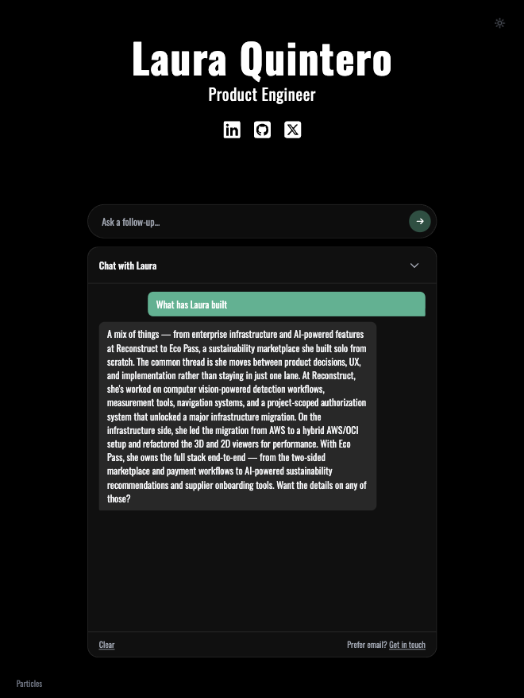

# lauraq.co

[](https://github.com/LQuintero/personal-page/actions/workflows/ci.yml)

**Live at [lauraq.co](https://lauraq.co)**

My personal site — and a working demo of how I build product. The centerpiece is an AI chat assistant I designed and shipped end-to-end: grounded prompting, build-time codegen, rate limiting, shared validation, and a deliberate UX that treats the conversation as part of the page rather than a widget bolted onto it.



<!-- TODO: replace static screenshot with a short GIF of a live chat interaction -->

## The AI chat assistant

Visitors can ask the assistant about my work directly on the homepage. It's built as a real product feature, not a wrapper around an API call:

- **Grounded in a curated facts pack.** The assistant only answers from `chat/facts.md` — information I chose to share. If a fact isn't there, it says so rather than inventing one. Voice, guardrails, and a deny-list live in `chat/system-prompt.md`.
- **Build-time codegen pipeline.** `chat/facts.md` and `chat/system-prompt.md` are the source of truth. A build script (`scripts/build-chat-prompt.mjs`) bundles them into a generated TypeScript constant via npm `prebuild`/`predev` hooks — editing a markdown file is all it takes to change the assistant's knowledge or behavior, with no runtime file reads and no separate build step to remember.
- **Inline conversation, not a floating bubble.** The chat is a pill input embedded between the title block and social links. The thread grows downward while the header stays fixed — a product decision to make the conversation read as part of the page.
- **Production concerns handled.** Per-IP rate limiting via Upstash Redis (with its own limiter, separate from the contact form's), shared Zod validation on client and server, prompt-injection resistance, and a frontend safety net that strips stray markdown from responses.
- **Iterated from live testing.** Prompt shape, formatting rules, and response length were all tuned based on real conversations, with worked good/bad examples baked into the system prompt.

Full write-up: [docs/CHAT_WIDGET.md](docs/CHAT_WIDGET.md)

## Stack

- **Framework**: Next.js 14 (App Router)
- **Styling**: Tailwind CSS
- **AI chat**: Claude API, called directly from a dedicated API route
- **Email**: Resend
- **Rate limiting**: Upstash Redis
- **Validation**: Zod (shared between client and server)
- **Font**: Oswald (Google Fonts)

## React patterns

- Custom hooks (`useContactForm`, `useChatBar`) each encapsulate all state, validation, and submission logic for their feature — the same pattern applied consistently across the contact form and the chat assistant
- Shared Zod schemas validate the same rules on both client (before fetch) and server (API route), for both the contact form and chat requests
- A `(main)` route group scopes the `Footer` to the home page via its own layout, so `/contact` never renders it — no client-side pathname check needed
- `ParticleScripts` sequences dependent script loading via `next/script` and state

## Project structure

```
app/          Next.js routes and API handlers (contact, chat)
chat/         Source of truth for the chat assistant's behavior
  facts.md          The only facts the assistant can draw from
  system-prompt.md  Voice, guardrails, deny-list
client/       React components, hooks, types, and site config
  components/
  hooks/
  types/
  site.config.ts   ← personal data lives here
scripts/      Build-time codegen (bundles chat/*.md into a TS constant)
server/       Server-only utilities (email service, chat service, rate limiter, error handler)
shared/       Code shared between client and server (Zod validators)
public/       Static assets (particle background: soulwire's sketch.js, MIT)
docs/         Feature documentation (chat widget)
```

## Testing

Unit tests cover the Zod validation schemas, both API routes' rate-limit/validation/success branches (contact and chat), the chat question log's answered heuristic, and the `useChatBar` hook — including the race guard that keeps an in-flight reply from repopulating a cleared thread:

```bash
npm test         # run once
npm run test:watch
```

## Running it locally

```bash
npm install
cp .env.example .env.local   # fill in your values
npm run dev
```

`npm run dev` regenerates the chat assistant's bundled prompt from `chat/*.md` automatically before starting. Open [http://localhost:3000](http://localhost:3000).

### Environment variables

| Variable                   | Required   | Description                                                                                         |
| -------------------------- | ---------- | --------------------------------------------------------------------------------------------------- |
| `RESEND_API_KEY`           | Yes        | Resend API key                                                                                      |
| `RESEND_FROM_EMAIL`        | Yes        | Sender address (must be a Resend-verified domain), e.g. `Your Name <you@yourdomain.com>`            |
| `RESEND_TO_EMAIL`          | Yes        | Where contact form submissions go                                                                   |
| `ANTHROPIC_API_KEY`        | Yes        | Anthropic API key, powers the chat assistant                                                        |
| `CHAT_MODEL`               | No         | Overrides the default chat model                                                                    |
| `UPSTASH_REDIS_REST_URL`   | Production | Upstash Redis URL for rate limiting (shared by the contact form and chat) and the chat question log |
| `UPSTASH_REDIS_REST_TOKEN` | Production | Upstash Redis token                                                                                 |

Rate limiting and the chat question log are silently disabled in development if the Upstash variables are not set.

## Deploy

Deploy to Vercel and set the environment variables in the project settings. The Upstash Redis variables are required in production — API routes will fail at the first request without them. `npm run build` regenerates the chat assistant's prompt bundle automatically (via npm's `prebuild` hook).

## Make it your own

The site is structured so the personal parts are isolated from the machinery. To adapt it:

- Edit `client/site.config.ts` for name, tagline, social links, and metadata:

```ts
const siteConfig = {
  name: 'Your Name',
  tagline: 'Your tagline',
  social: {
    linkedin: 'https://linkedin.com/in/yourprofile',
    github: 'https://github.com/yourusername',
    twitter: 'https://x.com/yourhandle',
  },
  metadata: {
    title: 'Your Name',
    description: 'Your description',
  },
};
```

- Edit `chat/facts.md` and `chat/system-prompt.md` to set what the chat assistant knows and how it behaves — see [docs/CHAT_WIDGET.md](docs/CHAT_WIDGET.md) for details.

## License

[MIT](LICENSE)
